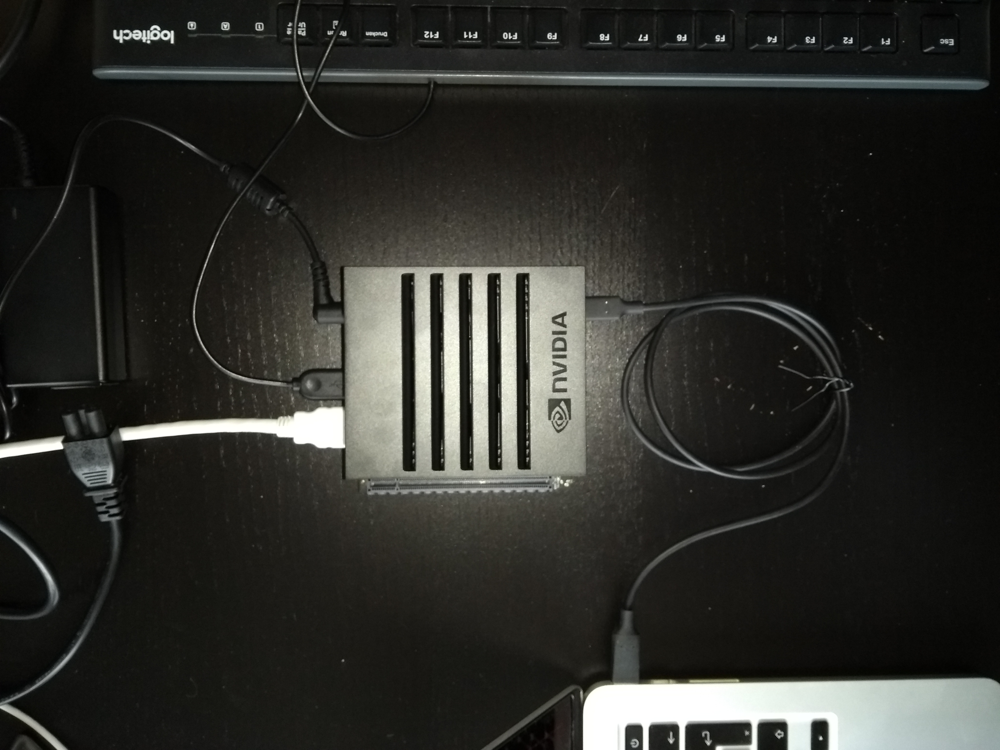
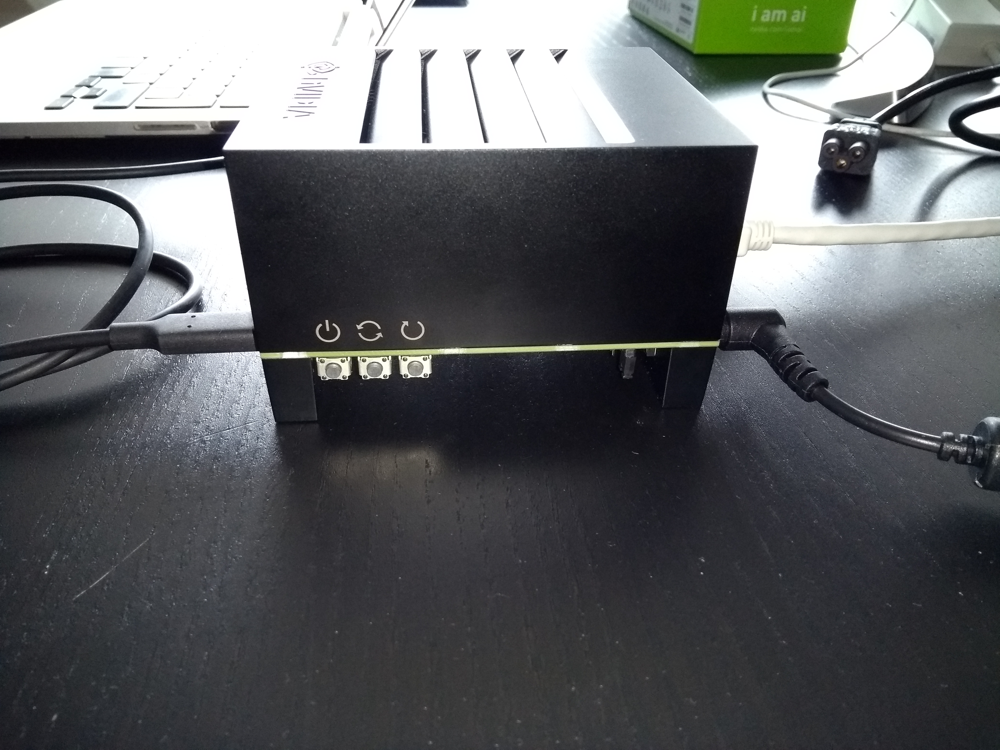
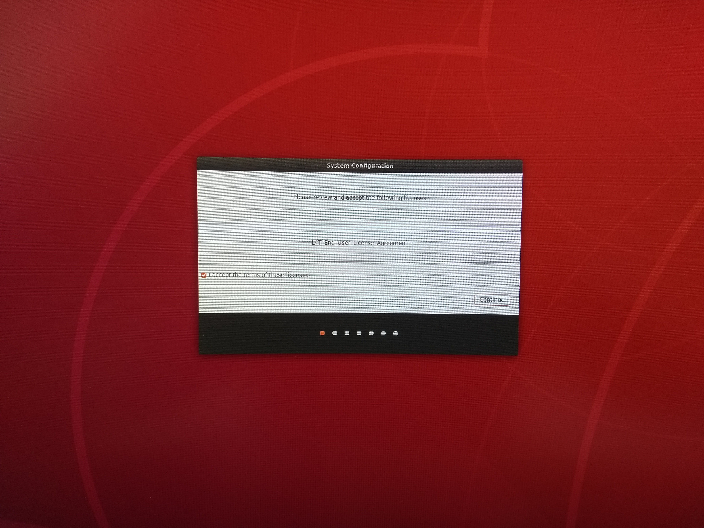

# NVIDIA Jetson AGX Xavier

The _NVIDIA Jetson AGX Xavier_ is a developer board based on an 8-core ARM CPU including 
a powerful 512-core Volta GPU that enables the device to cope with complex AI tasks while
ensuring quick inference times. NVIDIA provides a nice 
[overview](https://developer.nvidia.com/embedded/jetson-agx-xavier-developer-kit)
providing all the technical details and specifications of the board.

## Board Setup

Unfortunately the setup of an NVIDIA Jetson is not as simple and straightforward as for 
a Raspberry Pi. The setup includes multiple manual steps to be completed before you can
successfully connect the device to Reswarm.

### Host device with Ubuntu 18.04 or Ubuntu 16.04

The NVIDIA specific setup of their devices requires a host (Laptop or Desktop machine)
running Ubuntu 18.04 or Ubuntu 16.04. To install one of these you first have to download
the corresponding iso-image for 
[Ubuntu 18.04](https://old-releases.ubuntu.com/releases/18.04.5/ubuntu-18.04-desktop-amd64.iso) 
(or 
[Ubuntu 16.04](https://releases.ubuntu.com/16.04/ubuntu-16.04.7-desktop-amd64.iso)
) and write it to a USB flash memory or an SD card. This can be conveniently done with
the 
[Record Evolution Reflasher](https://www.record-evolution.de/en/introducing-the-record-evolution-reflasher-or-how-we-built-the-worlds-best-flashing-app-for-iot-devices/).
After successfully writing the iso-image to the flash memory, insert the flash memory 
into your host machine, restart the machine and enter the boot menu to boot from the 
flash memory. Just follow along the steps during the initial setup process of Ubuntu.
After completing the intial setup and rebooting in the OS please make sure to have 
the `qemu-user-static`, any `python2.x` package and an appropriate soft link
`/usr/bin/python -> /usr/bin/python2.x` to the python2.x binary installed. If you don`t,
please open up a terminal and execute:

```
sudo apt-get install update && apt-get upgrade
sudo apt-get install qemu-user-static
sudo apt-get install python2.x
sudo ln -s /usr/bin/python2.x /usr/bin/python
```

### Prepare NVIDIA root filesystem 

Given that you successfully installed Ubuntu 18.04/16.04 on a host machine you can now
start to connect the hardware in the following way:

<p align="center">
  
</p>

Please don`t connect the power plug before everything else is connected! First of all,
we have to connect the Jetson board with the host machine by means of an USB-C to USB-A/C
cable (depending on your host machine). Secondly, we have to connect the HDMI output of 
the board to an external screen for the sake of being able to complete the graphical
user setup later. Finally, we have to connect an USB keyboard in order to fill the forms 
of the graphical setup. After having everything connected like in the picture above you
may finally connect the power plug as well (_without_ pushing the power button of the board!!).
Now, we have to put in the board into so-called _FORCE RECOVERY MODE_ which is done by
pushing and holding the three button on the side of the board (see the picture below) 
in the following order:

1. push and keep holding the Force Recovery button (center button)
1. push and hold and the Power button (left button)
1. release the power button
1. release the force recovery button

<p align="center">
  
</p>

That procedure puts the NVIDIA board into force recovery mode. To confirm that,
please open up a terminal on your Ubuntu host machine and type:

```
lsusb | grep -i nvidia
```

The expected output is of the form:

```
Bus xxx Device yyy: ID nnnn:7019 NVidia Corp.
```

If you don`t see this result but none output at all, please go back to trying to put
the board into force recovery mode.

Now, we have to prepare the root file system for the NVIDIA board on our host system.
To this end, download the required 
[latest drivers](https://developer.nvidia.com/embedded/linux-tegra-archive), e.g. the 
[L4T 32.6.1 Release archive](https://developer.nvidia.com/embedded/l4t/r32_release_v6.1/t186/jetson_linux_r32.6.1_aarch64.tbz2) 
and the corresponding root filesystem, e.g. 
[Sample Root Filesystem 32.6.1](https://developer.nvidia.com/embedded/l4t/r32_release_v6.1/t186/tegra_linux_sample-root-filesystem_r32.6.1_aarch64.tbz2) 
to the host machine. Start by extracting the driver archive by:

```
tar xf Jetson_Linux_r32.6.1_aarch64.tbz2
```

which produces the directory `Linux_for_Tegra` in the same folder. Enter the folder
`Linux_for_Tegra/rootfs/` and extract the root filesystem into it by:

```
cd Linux_for_Tegra/rootfs/ && sudo tar xpf ../../<path-to-downloaded-rootfs-archive>/Tegra_Linux_Sample-Root_Filesystem_R32.6.1_aarch64.tbz2
```

where it is ESSENTIAL to do this as root with the flags `xpf` in order to preserve 
the permission and owernships in the root filesystem. Next we have to prepare some
binaries by:

```
cd Linux_for_Tegra/ && sudo ./apply_binaries.sh
```

After successfull completion of this step we can finally flash the internal 
board memory by (while making sure that the device is still in FORCE RECOVERY MODE):

```
cd Linux_for_Tegra/ && sudo ./flash.sh jetson-agx-xavier-devkit mmcblk0p1
```

Depending on your host machine this may take up to about five minutes to complete.
After the script is succesfully finished the NVIDIA board will automatically 
reboot and start to show the initial user setup on the connected HDMI screen.

<p align="center">
  
</p>

## Reswarm Connection

After successfully finishing the basic board setup and completing the initial
user setup, make sure to connect the board to a working ethernet connection,
reboot it and log in either directly via the graphical user interface and keyboard
or via ssh on the local network. Proceed with the following steps in order
to connect your NVIDIA device to Reswarm Platform:

1. make sure the system is up-to-date by executing 
	`sudo apt-get update && sudo apt-get upgrade` 
1. download the Reswarm device setup shell script
	`wget https://storage.googleapi.com/reswarmos/`
1. make sure the script is executable:
	`chmod +x setup-reswarm-device.sh`
1. copy your confidential `.reswarm` configuration file to the device, e.g. by
	`scp <your-reswarm-device-config>.reswarm <user-name>@<local-ip-of-board>:
1. execute the (idempotent) Reswarm-script to transform the board into a Reswarm device
	`sudo ./setup-reswarm-device.sh <your-reswarm-device-config>.reswarm`

Log in to your Record-Evolution account and check for the connected device.

