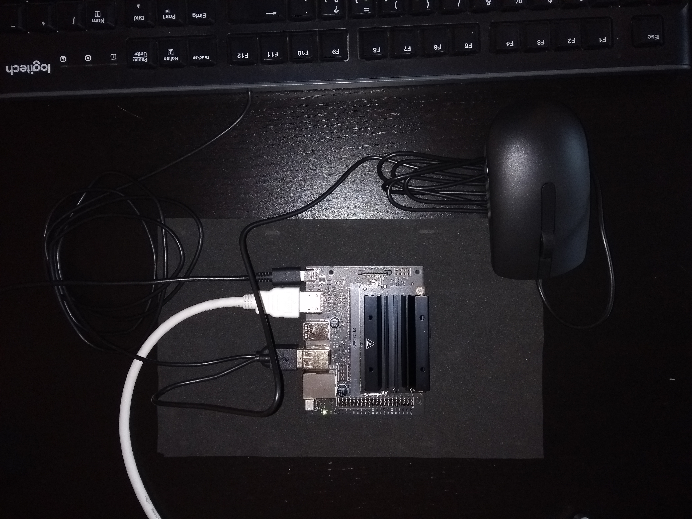
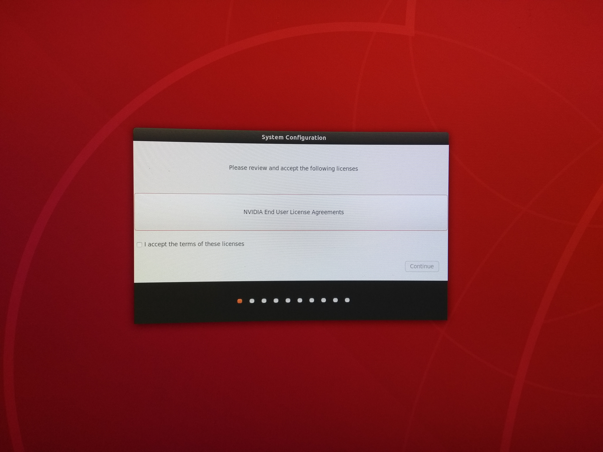

# NVIDIA Jetson Nano 2GB Developer Kit

The _NVIDIA Jetson Nano_ is a developer board based on an Quad-Core ARM A57 CPU including 
a 128-core Maxwell GPU that enables the device to cope with complex AI tasks while
ensuring quick inference times. NVIDIA provides a nice 
[overview](https://developer.nvidia.com/embedded/jetson-nano-2gb-developer-kit)
providing all the technical details and specifications of the board.

## SD card preparation

NVIDIA provides ready-made [SD card images](https://developer.nvidia.com/embedded/downloads#?search=Jetson%20Nano%20Developer%20Kit%20User%20Guide) 
including a suitable Ubuntu based operating
system including drivers for NVIDIA hardware support. This image is available as 
[Jetson Nano SD card image](https://developer.nvidia.com/jetson-nano-2gb-sd-card-image).
Download the image - which may take a few minutes depending on your internet connection -
and extract the zip archive by e.g.

```
unzip jetson-nano-2gb-jp46-sd-card-image.zip
```

The resulting image file `sd-blob.img` has to be written to the micro SD card (at least 
32GB size). For instance, this can be accomplished with the
[Record Evolution Reflasher](https://www.record-evolution.de/en/introducing-the-record-evolution-reflasher-or-how-we-built-the-worlds-best-flashing-app-for-iot-devices/),
which not only works as a GUI based tool but also on CLI level, i.e.

```
sudo reflasher-cli -d </dev/sdX> -i sd-blob.img
```

where `/dev/sdX` has to be replaced by the device corresponding to your micro SD card 
connected to the host machine. The available external flash drives may be listed
by `reflasher-cli -l`. Since the `sd-blob.img` is about 13GB of size this process may
take about 10-15 minutes depending on the performance of your SD card. Make sure to 
wait until the image write process is successfully finished and the image is succesfully
validated.

## Board Setup

Before you proceed with setup of the board make sure to familiarize yourself with the 
basic features and components of the 
[Jetson Nano board](https://developer.nvidia.com/embedded/learn/jetson-nano-2gb-devkit-user-guide#id-.JetsonNano2GBDeveloperKitUserGuidevbatuu_v1.0-Introduction).
Although the Jetson Nano can be initially set up in headless mode we stick to the GUI-kind
of setup. Make sure the board is powered off and disconnected from any power-plug. Furthermore,
ensure the freshly flashed SD card is inserted into the board's micro SD card slot. The 
SD card slot is located at the read-side of the board at the lower end of the Jetson module
in an upside-down position. 

<p align="center">
  
</p>

Finally, we have to connect the HDMI output of the board to a monitor to be able to 
follow along the initial OS setup. Additionaly, the setup requires a keyboard and/or
mouse to be connected to the board via the two USB 2.0/3.0 interfaces.
If in doubt about any plugs or connectors, please consult the board description of the 
[Jetson Nano board](https://developer.nvidia.com/embedded/learn/jetson-nano-2gb-devkit-user-guide#id-.JetsonNano2GBDeveloperKitUserGuidevbatuu_v1.0-Introduction). At last, connect the USB-c power-plug to the board which 
is located at the front-left side of it. MAKE SURE to only use a power-adapter that 
satifies 5V @ 3A .

<p align="center">
  
</p>

## Initial OS setup

After powering the board it will automatically start to boot and show the intial
setup screen.

<p align="center">
  
</p>

Simply follow along the setup wizard and customize the board according to 
your needs.

## Reswarm Connection

After successfully finishing the basic board setup and completing the initial
user setup, make sure to connect the board to a working ethernet connection,
reboot it and log in either directly via the graphical user interface and keyboard
or via ssh on the local network. Proceed with the following steps in order
to connect your NVIDIA device to the Reswarm Platform:

1. make sure the system is up-to-date by executing 
	`sudo apt-get update && sudo apt-get upgrade` 
1. download the Reswarm device setup shell script
	`wget https://storage.googleapis.com/reswarmos/nvidia/reswarmify-nvidia.sh`
1. make sure the script is executable:
	`chmod +x reswarmify-nvidia.sh`
1. copy your confidential `.reswarm` configuration file to the device:
	`scp <your-reswarm-device-config>.reswarm <user-name>@<local-ip-of-board>:`
1. execute the (idempotent) Reswarm-script to transform the board into a Reswarm device
	`sudo ./reswarmify-nvidia.sh <your-reswarm-device-config>.reswarm`

Log in to your Record-Evolution account and check for the connected device.
