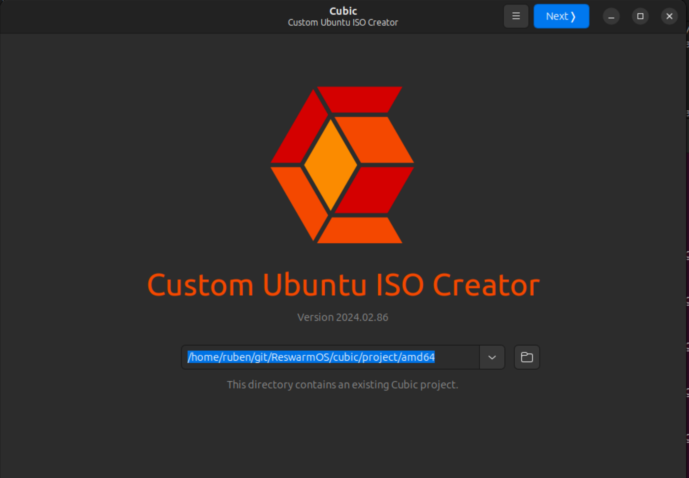
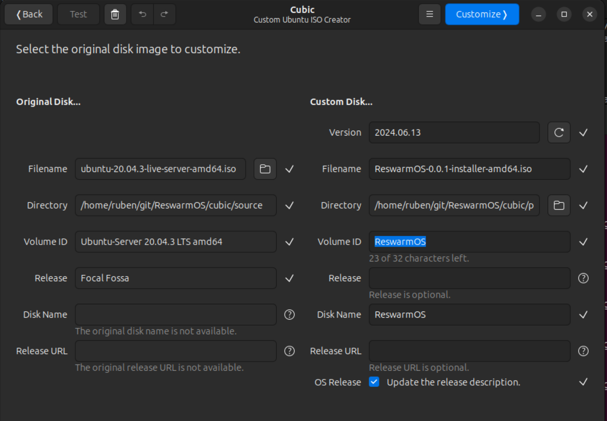
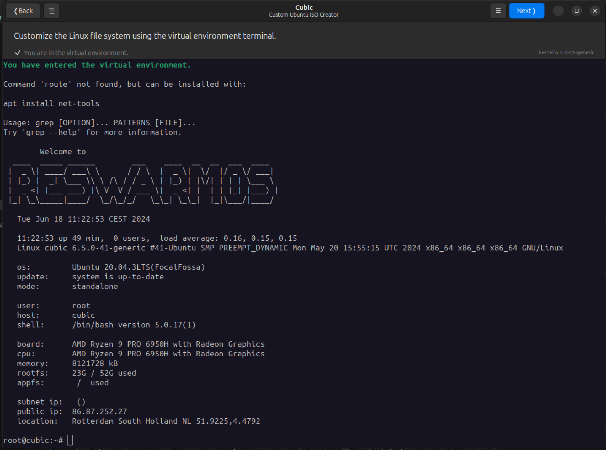
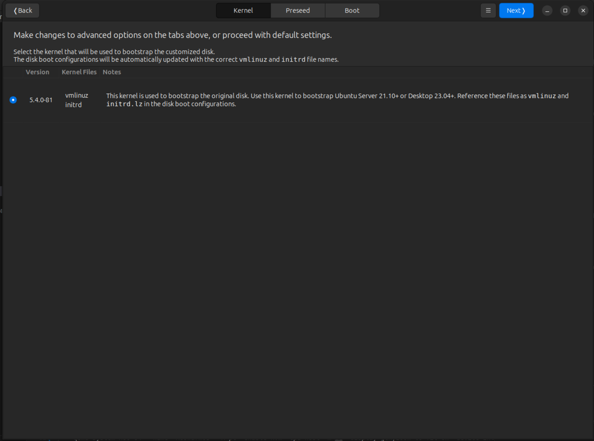
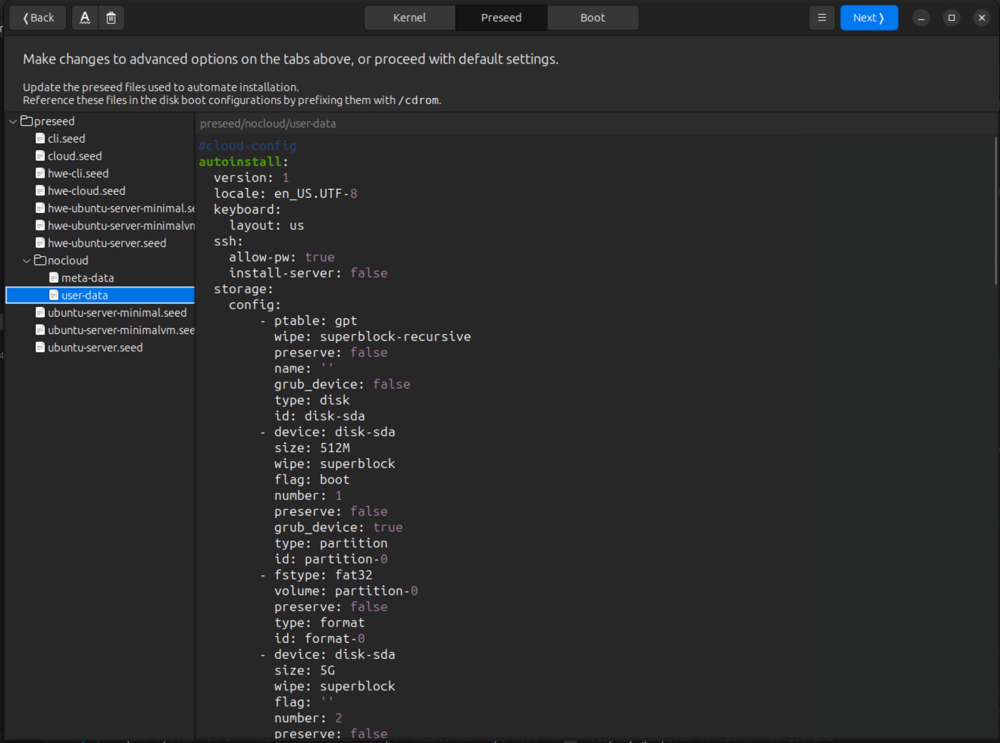
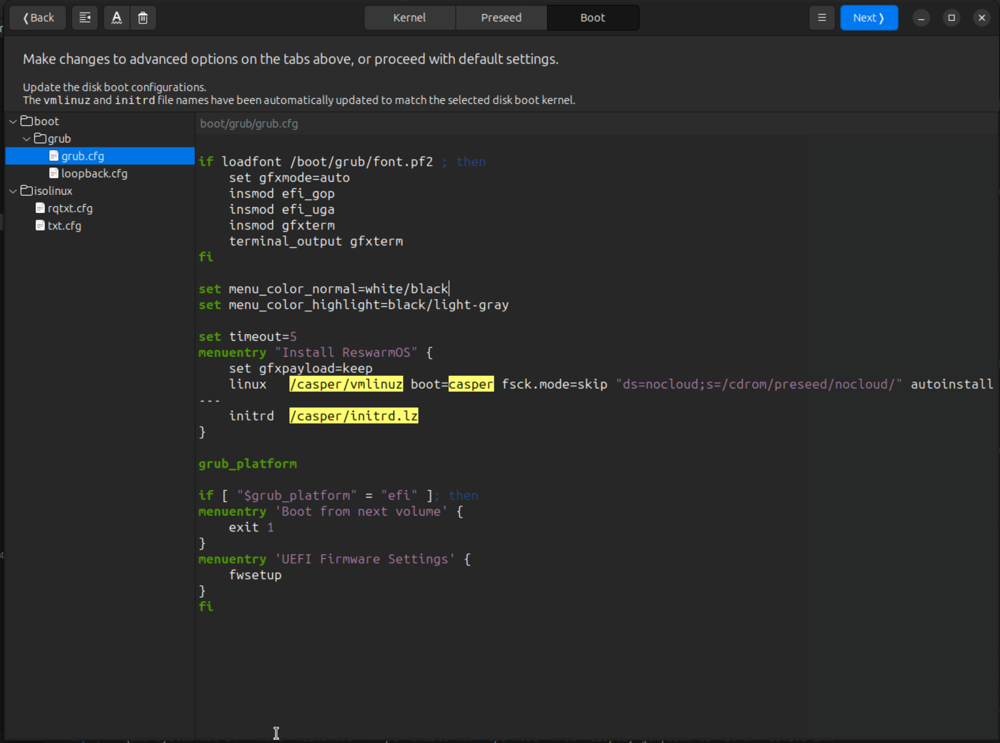
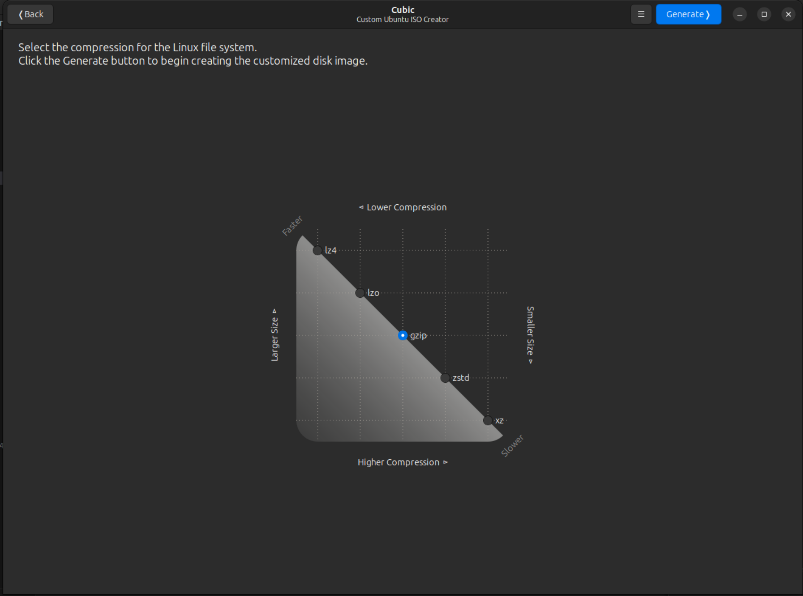
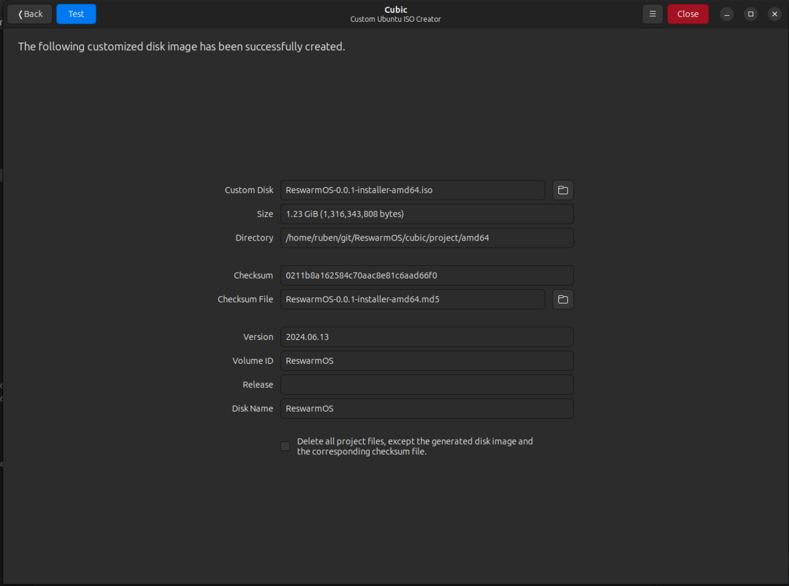

# Ubuntu-based ReswarmOS (Installer) using Cubic

## About Cubic

Cubic is a tool that allows you to easily edit Ubuntu installer images. It comes with scripts that help extract and repackage the ISO image. We will use this tool to set up our ReswarmOS installer.

## Setup (Using Ubuntu 23.10 VM)

### Cubic Installation

Cubic has already been installed on the Ubuntu VM, so this step can be skipped.

## Source Image

The ReswarmOS installer must be created from a source image; in this case, we're using `Ubuntu Server 20.04.3`. 

In the VM, the source image already exists in the `cubic/source` folder.

Not all installer images are supported by Cubic; however, most, if not all, Ubuntu images should be supported. It is possible to upgrade to a newer version of Ubuntu, but the file structure of each installer image is different, so the overlay files would need to be adjusted accordingly.

If the source image doesn't exist, it can be downloaded using the `make download-source` command.

## Using Cubic

The Cubic setup tool can be started using the `make setup-amd64` command.

Project directory: `/home/ruben/git/ReswarmOS/cubic/project/amd64`

**Initial screen**



**General metadata**



**Virtual Environment**

The Cubic tool will extract the contents of the root filesystem from the installer image into the `project/amd64/custom-root` directory. This directory is then mounted into a virtual shell environment, allowing you to run commands within it.

To overlay the root filesystem of the installer image, use the `make overlay-fs-amd64` command. This command copies all the files from the `cubic/project/rootfs-overlay` directory into the `project/amd64/custom-root` directory.

The `custom-root` directory, as mentioned above, represents the final root filesystem that will be flashed onto the installer.

For a fresh VM or installer image, you must also execute the commands found in the `cubic/scripts/setup-rootfs.sh` file. This will set up Docker, enable the necessary systemd services, and more.

Unless you are working from a fresh installer image or VM, this step is generally not necessary, as the filesystem has already been overlaid. However, if you make changes to the filesystem, reapplying the overlay will be required.



#### Debugging the Virtual Environment

If the virtual environment does not load (displays 'You have exited the virtual environment'), it means the cubic.conf file has been corrupted in some way. Try to remove the cubic.conf file and restart the Cubic tool.

## Kernel, Preseed, and Boot

In the following step, you will be able to customize the kernel, preseed, and boot settings. These configuration files and the kernel itself are stored in the `project/amd64/custom-disk` folder of the installer ISO.

In the kernel tab, for the Ubuntu 20.04.3 installer ISO, only one kernel can be selected.



The preseed folder contains several configuration files that can be used to 'preseed' the ISO installer. None of these default files will be used; instead, we will use our own custom `autoinstall` configuration file. The autoinstall configuration is an officially supported feature of both Ubuntu Desktop and Server installers. 

Our `autoinstall` configuration handles everything from setting up partitions (important for our AB partitions) to post-installation commands (such as switching the boot order post-install) and more. A reference to the autoinstall configuration can be found [here](https://canonical-subiquity.readthedocs-hosted.com/en/latest/reference/autoinstall-reference.html).

In a more common scenario, the autoinstall configuration is provided over the internet or another hard drive. However, in this case, we will include the autoinstall configuration in the ISO and provide it as a parameter in the `boot.cfg` for the kernel to load.

We have two separate autoinstall configurations: one for EFI bootloaders and another for BIOS-only bootloaders. We provide both configurations to also support legacy computer hardware.

The installation configuration is stored in the `project/amd64/custom-disk` folder of the extracted ISO installer. In the VM, the `custom-disk` folder already contains the autoinstall configuration files. If you wish to update or provide new configuration files, you can use the `setup-efi-amd64` or `make setup-bios-amd64` commands.



In the final step, we will configure the boot configuration. The Ubuntu installer has configurations for both SYSLINUX and GRUB bootloaders. The TLDR is that both are provided for better hardware support for both newer and older devices.

Just like the autoinstall configuration, the boot configuration is also stored in the `custom-disk` folder. To transfer the boot configuration from the ReswarmOS folder, use the `make setup-boot-amd64` command.

In our `boot.cfg`, we add an 'Install ReswarmOS' entry in the boot menu that loads the kernel and enables the auto installer using our autoinstall configuration.



Before Cubic combines all `custom-*` folders into an ISO, it will ask which compression method to use. We will stick with the default, which is gzip. The resulting ISO will have the `.iso.gz` extension.



The disk will then be combined into the final edited ReswarmOS installer ISO.



## Testing the ISO

Since running a VM within a VM can be tricky, the best approach is to copy the finished ISO to the host system and then run the actual installer ISO on a host VM.

The VirtualBox VM will, by default, mount the `/home/ruben/Desktop/VM` folder to the `$HOME/Desktop/VM` folder. This folder can be used to transfer the finished ISO between the guest and host.

The following commands can be used to create a disk image and to run the ISO using `qemu`:

```bash
qemu-img create reswarm.img 16G
```

**For Linux**
```bash
qemu-system-x86_64 --name "ReswarmOS" -bios PATH_TO_OVMF/OVMF.fd -M pc -enable-kvm -cpu host -vga virtio -m 8G -display gtk,zoom-to-fit=on -device intel-hda -device hda-duplex -drive format=raw,file=PATH_TO_IMG_FILE.img -cdrom PATH_TO_ISO_INSTALLER.iso -net nic,model=virtio -net user,hostfwd=tcp::2222-:22
```

## Release

To release and update the remote Cubic project files, first bump the target version in the `versions.json`.

Afterward, you can archive your local Cubic project files and push them to the GCloud repository using:

```bash
$ make release
```

## Development VM

A development virtual machine (VM) has been set up for developing and compiling the operating system.

The Ubuntu 23 VM is stored in the Google Cloud bucket [flockos-vm](https://storage.cloud.google.com/flockos-vm/Ubuntu23.ova?authuser=1).

The VM can be run in Google Cloud. For more information, check [here](https://aroque.medium.com/how-to-run-your-virtualbox-applications-on-the-google-cloud-362905e077e9#:~:text=Depending%20on%20the%20OVA%20set,instance%20with%20a%20GUI%20interface.).